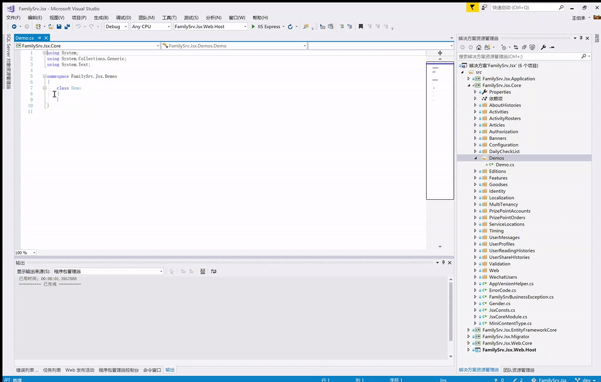

# abplus.snippets

Abp Code Snippets For Visual Studio Code And Visual Studio

vscode  

| Prefix | Remark |
| :--------- | :-------- |
| ivcreate | iview 创建弹层 |
| ivedit | iview 编辑弹层 |
| ivlist | iview 列表页 |
| ivmod-crud | vuex 模块代码，状态及api调用 |  

vs2017

|Shortcut|Remark|  
|:---|:---|
|entityfa|继承FullAuditedEntity的实体|
|entityca|继承CreationAuditedEntity的实体|
|dbset|在DbContext中添加新实体|
|iasynccrud|AppService接口|
|asynccrud|AppService|
|entitydto|带AutoMapFrom的实体Dto|
|mapprofile|AutoMapper对象映射规则|
|pagedreqdto|继承PagedResultRequestDto的分页接口请求参数Dto|

# Setup-安装 

## vscode

启动 Visual Studio Code，依次打开`文件`->`首选项`->`用户代码片段`->`新建全局代码片段`，在弹出的文件资源管理器中复制目录地址，如（perso是我的用户名）：

    C:\Users\perso\AppData\Roaming\Code\User\snippets

将本代码库vscode目录中的所有代码片段复制到该目录下，重新打开VSCode即可使用。

## vs2017

确认是否存在类似如下目录（注意目录中perso应该是你自己的用户名）：

    C:\Users\perso\Documents\Visual Studio 2017\Code Snippets\Visual C#\My Code Snippets

将本代码库vs2017目录中的所有代码片段复制到该目录下，启动VS2017即可使用。

# 演示

## vscode

## vs2017

# 说明

目前vscode代码片段仅包含abp官方导出项目模板中的Vue SPA项目（使用的是Vue ui框架iview并使用了TypeScript，用yarn serve启动，yarn build 构建发布）。

欢迎大家提交ABP相关代码片段pr到本库，若有问题，请提issue。

## 版本
本库暂无版本管理，后续代码片段增加，若遇到prefix冲突或变更，再进行版本管理。以后可能在prefix或shortcut中添加前缀

## MIT
